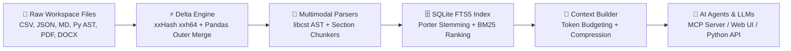

# DataPipe v2.1 ⚡
> **Incremental Multimodal Context Engine for AI Agents & Infinite Context Windows**

[](https://github.com/your-handle/datapipe)
[](https://python.org)
[](https://sqlite.org)
[](https://modelcontextprotocol.io)
[](#-interactive-web-ui-visualizer)

**DataPipe** turns your local codebases, documents, CSVs, PDFs, JSONs, and images into an **always-updated, token-budgeted context index** for AI agents. Instead of blowing past context window limits or paying massive token costs for raw file dumps, DataPipe continuously fingerprints changes with **xxHash**, chunks multimodal inputs, and serves high-density BM25 context snippets via **MCP (Model Context Protocol)**, **CLI**, and a **Web UI Dashboard**.

---

## ⚡ Architecture Flow



---

## 🚀 Key Features for AI Context Engineering

| Feature | Description | Benefit for AI & LLMs |
|---|---|---|
| ⚡ **xxHash Fingerprinting** | 64-bit non-cryptographic hash (~10x faster than SHA-256) | Scans 100,000+ files instantly; re-indexes only mutated code/docs. |
| 🧩 **Multimodal Parsers** | CSV, JSON, Markdown, AST-aware Python (libcst), PDF, HTML, DOCX, OCR | Understands structured data and code syntax natively. |
| 🔌 **MCP Server (Stdio)** | Model Context Protocol JSON-RPC 2.0 implementation | Native integration with Claude Desktop, Cursor, AGY, and VS Code. |
| 🧠 **Token Context Builder** | Token estimator, BM25 ranker, XML wrapper | Enforces strict max-token budgets (e.g. 4000 tokens) with ~85% token savings. |
| 🎨 **Interactive Web UI** | Dark-mode live dashboard server (`datapipe ui`) | Hackathon-ready visual flow, search playground, and session logs. |
| 📜 **Session Memory Log** | Persistent tool calls & edit tracking in SQLite | Context survives process restarts and context window truncation. |

---

## 📥 Installation

```bash
git clone https://github.com/your-handle/datapipe.git
cd datapipe

python -m venv .venv
source .venv/bin/activate

# Install in editable mode with core dependencies
pip install -e .

# Optional: Full multimodal parsing (PDF, HTML, DOCX, OCR, libcst)
pip install pypdf beautifulsoup4 python-docx pytesseract Pillow libcst
```

---

## 💡 Quick Start

### 1. Write a Pipeline Config (`my_pipeline.py`)

```python
from datapipe import Pipeline, Store
from datapipe.parsers import auto_transform

store = Store("./datapipe_index.db")

pipe = (
    Pipeline("knowledge_base", store)
    .source("./data", patterns=["*.csv", "*.json", "*.md", "*.py"])
    .transform(auto_transform)
    .columns(["text", "chunk_index"])
)
```

### 2. Index the Pipeline

```bash
# Run one-shot incremental indexing
datapipe update my_pipeline.py

# Live watch mode — automatically re-indexes whenever files change
datapipe update my_pipeline.py --live
```

### 3. Launch the Interactive Web UI Visualizer Dashboard 🎨

```bash
datapipe ui my_pipeline.py --port 8500
```
Opens an interactive dashboard with live architecture flow, context compression simulator, BM25 search playground, and session memory logs.

---

## 🤖 Integrating with AI Agents (MCP Server)

DataPipe includes a built-in **Model Context Protocol (MCP)** server. You can connect it directly to **Claude Desktop**, **Cursor**, **AGY**, or any MCP-compliant AI tool.

```bash
datapipe mcp my_pipeline.py
```

### MCP Tools Provided to AI Agents:
- `datapipe_search`: Full-text BM25 search across indexed files.
- `datapipe_get_context`: Formatted, token-budgeted XML context block with compression metrics.
- `datapipe_session_snapshot`: Retrieves agent tool execution history and modified files.
- `datapipe_sql`: Runs arbitrary SQL analytics queries against the index database.

---

## 🛠️ CLI Reference

```bash
datapipe update  <config.py> [-L] [-f]     # Index pipeline; -L = live mode, -f = force
datapipe ui      <config.py> [-p 8500]     # Launch Web UI Visualizer dashboard
datapipe context <config.py> <query> -m 4000 # Build token-budgeted AI context block
datapipe search  <config.py> <query>       # BM25 full-text search
datapipe mcp     <config.py>               # Start Model Context Protocol stdio server
datapipe sql     <config.py> <sql>         # Raw SQL query against SQLite index DB
datapipe stats   <config.py>               # Print file count and row stats
datapipe session <config.py> <key>         # Print session resume snapshot
datapipe doctor                            # Environment & dependency check
```

---

## 🐍 Python API Example

```python
from datapipe import Pipeline, Store, ContextBuilder

store = Store("./datapipe_index.db")
pipe = Pipeline("docs", store)

# Build a 4,000-token context block for an LLM prompt
ctx = ContextBuilder(pipe).build_context("SQLite FTS5 indexing", max_tokens=4000)

print(f"Tokens Used: {ctx['used_tokens']} / {ctx['max_tokens']}")
print(f"Token Savings: {ctx['token_savings_pct']}%")
print(ctx["formatted_text"])
```

---

## 🧪 Running Tests

```bash
pytest                    # Runs all 48 unit & integration tests
```

---

## 📄 License

Apache 2.0
